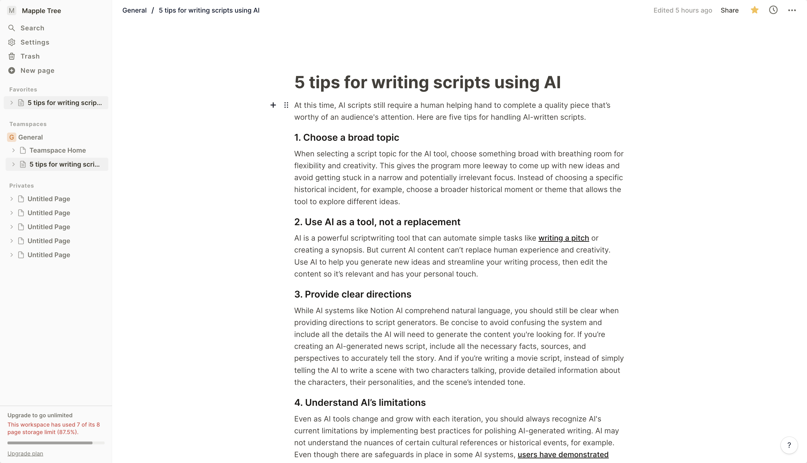

# Camille
A note-taking web application where you can think, write, and plan



## Technologies
1. Next.js (React.js)
2. Tailwind (Styling)
3. Typescript (Statically Checked Types)
4. NextAuth.js (Authentication)
5. Stripe (Payment)
6. Prisma (Object-Relational Mapping)
7. PlanetScale (Database)

## Work In Progress
The app is being under maintenance, as more work needs to be done.

Current functionality includes:
- Sign in, Sign out, Email Verification, OAuth via GitHub, Google
- CURD workspace, teamspace, notebook, page
- Soft delete, undo delete, hard delete page
- Add to favorite, duplicate, share to web, copy link page
- Add, remove, change role member in workspace
- Quick open and search all pages by dialog 
- Redirecting user to previous workspace, notebook, page after login
- Upgrade plan for workspace via Stripe (Testing Mode)

## Known Bugs
Feel free to email me at dauphaihau@gmail.com if you run into any issues or have questions, ideas or concerns. Please enjoy
and feel free to share your opinion, constructive criticism, or comments about my work. Thank you! 🙂

## Future Updates
- Improve overall UX/UI and fix bugs
- Nested page in page

And More ! There's always room for improvement!

## Installation
Install deps:
```bash
pnpm install
```

Copy .env.example to .env and update the variables.:
```bash
pnpm dev
```

## Deployed Version
<a href="https://camillee.vercel.app">Visit the live app</a>
